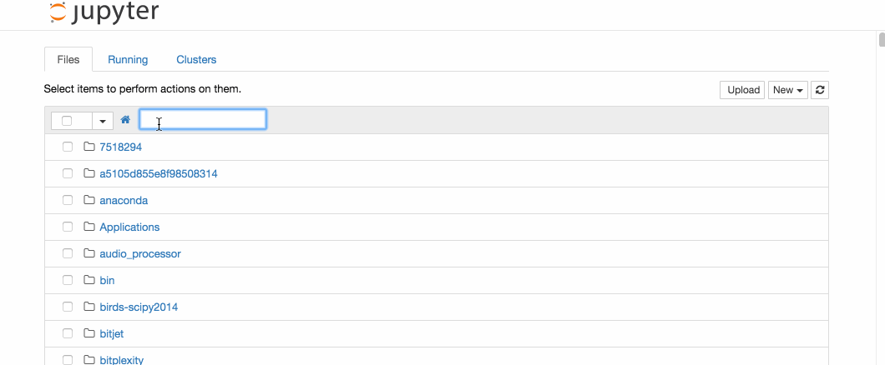
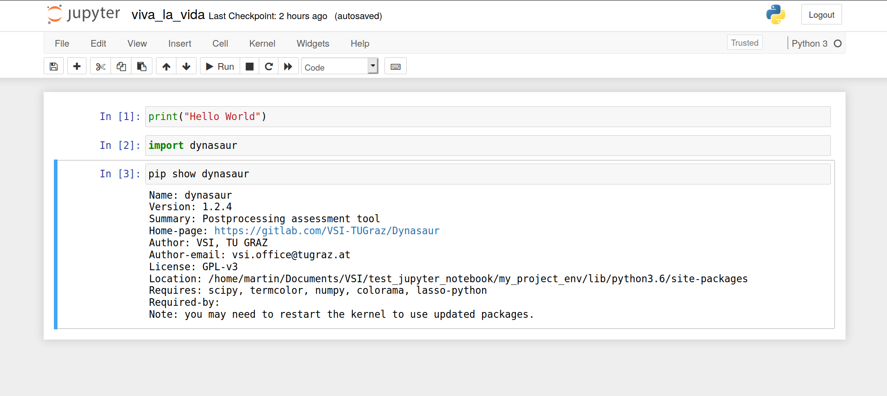

# **Pre-workshop setup for Jupyter Notebook**

The Jupyter Notebook app was developed to interactively process, visulize and present data. Notebooks are therefore files, which contain both executable code and rich text elements (such as equations, figures, links, etc.) and help to present and share reproducible research.
In general it can be used with several programming languages, including Python, Julia, R, Haskell, and Ruby. For the workshop we will work with Python.

In this tutorial we will guide you through setting up Jupyter Notebook on a Windows system. 
For Linux-Ubuntu installations I would recommend to follow [these instructions](https://www.digitalocean.com/community/tutorials/how-to-set-up-jupyter-notebook-with-python-3-on-ubuntu-18-04). If you use any other system, let us know, such that we can go through the installation together.


## **1. Python setup** 

For the use under Windows, we recommend [Anaconda](https://www.anaconda.com/) which is a free development environment for the Python programming language. In the [download archive](https://www.anaconda.com/) you should find the latest version that fits your system.
Anaconda comes with the environment management system ```conda``` which can be used to manage virtual Python environments.
In order to set up a new environment for this workshop, open Anaconda Prompt and type the following

```
>>> conda create -n viva_workshop python=3.7.9
```

Switch to the newly created environment

```
>>> activate viva_workshop
```

You have to install pip first such that additional packages can be created in that environment

```
>>> conda install pip
```

## **2. Dynasaur setup**

Further install the postprocessing library Dynasaur, which will automatically download all its dependencies 
and requirements will be installed automatically.

```
>>> pip install dynasaur
```

## **3. Install Jupyter**

In a next step you can install Jupyter Notebook in your newly created environment. 

```
>>> pip install notebook
```

Congratulations, you have installed Jupyter Notebook in your local enviroment! 
To run the notebook, run the following command:

```
jupyter notebook
```

A log of the activities of the Jupyter Notebook sever will be printed to the terminal, 
which you can access through the port number on which it is running (normally 8888)
So use your prefered browser and go to ```http://localhost:8888```. It should show you 
the Notebook Dashborad, which is file tree of the location from where it was initialized 
(maybe something like your home directory). 

{: style="width:600px"}


As a next step we want you to make sure that your dynasaur installation worked as well.
Therefore, download [Jupyter Notebook example](https://cloud.tugraz.at/index.php/s/Qz63xXRrGgzqQD5) 
and place it somewhere on your file system (maybe that one of your running Jupyter Notebook server).
Refresh the page and open the example notebook by clicking on it (if you want to close it, exit the browser 
tab and shut it down through the Notebook Dashboard). For further information about the usage check out the [detailed documentation](https://jupyter-notebook.readthedocs.io/en/stable/examples/Notebook/Notebook%20Basics.html).

Run the cells of the file by clicking on the run buttons. In the end you should end up with something like this:

{: style="width:600px"}

If you encounter any problem during the installation [please contact us](0-3-online-workshop-info.md).

