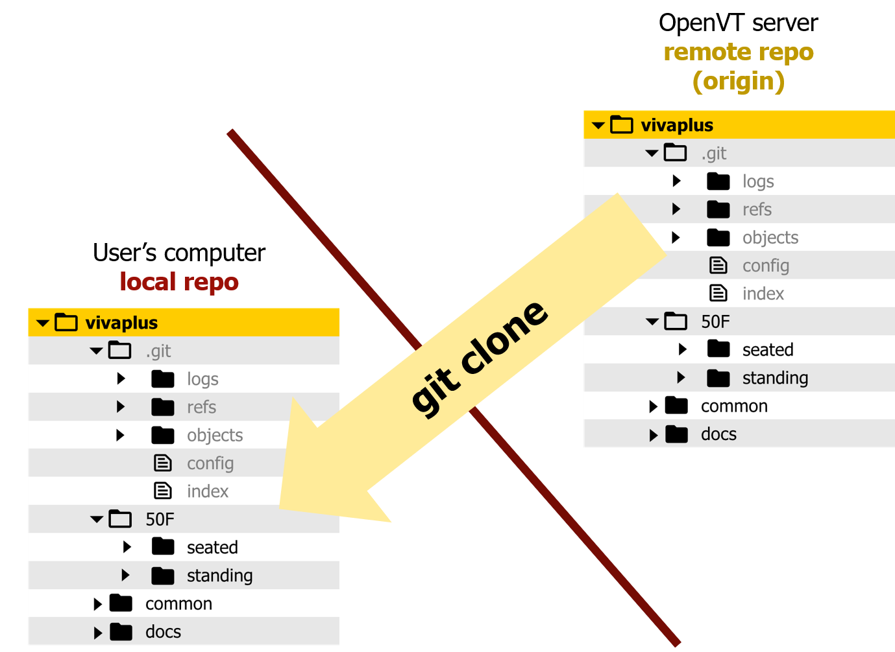

# **Introduction to Git**

!!! summary "Overview" 

    **Questions**

    - Why version control?
    - Why git?
    - How are files version controled in git?
  
    **Objectives** 
  
    - Learn what is automated version control
    - Aprreciate the need for version control
    - Understand git repository structure
   
## **Why Version Control?**

Before we start looking at the Git system, it is worth considering: _why bother using Git, when we can use file sharing platforms like Dropbox to collaborate._

!!! Error "Working in a Team"

    Imagine if 5 co-authors worked on a paper together using 'Track changes'. Either they have to work sequentially (slowing down the process) or they would have to manually merge their contributions. Also, even with track changes, you lose the history once the changes are accepted. 
     
    -   _“I will just finish my work and then you can start with your changes.”_
    -   _“Can you please send me the latest version?”_
    -   _“Where is the latest version?”_
    -   _“Which version are you using?”_

We see how cumbersome writing a paper in parallel can become. Imagine how laborious it can get when geographically spread-out teams collaborate to develop and maintain a finite element model.

Here are few reasons we need version control.

##### Easy Branching

- Work in parallel or on different features

##### Robust Colloboration

- Avoid accidentally overwriting or overlooking someone else's changes/updates. Good conflict management.

##### Roll-back functionality 

- Mistakes happen!
- Nothing commited to version control is ever lost
- Record of changes made: who and when. Makes it easy to track and go to previous version if needed
  
### What can be version controlled?

Version control systems were orginally used for software development, but we can use it to version control almost everything:

- Everything that needs to be shared
- anything that changes overtime
- papers, books, datasets.

And now Human Body Finite Element Models!

## **Why git?** 

- Most popular and widely used version control system
- Easy to setup - no server is required
- Efficient and distributed version control (no single point of failure, you can track and clean-up changes offline, simplifies collaboration model for open-source projects.)
- Important platforms such as [GitHub](https://github.com), [GitLab](https://gitlab.com), and [Bitbucket](https://bitbucket.org) build on top of Git.

_(This list is an abridged version from CodeRefinery course 'Introduction to Git' [^2])_
[^2]: https://coderefinery.github.io/git-intro/01-motivation/#why-git

## **Git Basics**

- **What does Git do?** Git tracks the content of a folder and tracks the changes over time as _snapshots_.
- When a change is ready to be saved, a **snapshot** of the folder is saved.
  - In the Git world, save is known as **commit**
- These commits are kept in a sub-folder called `.git`
- `.git` contains the whole repository/database (versions, history, ...)
- You can interact with Git through mulitple interfaces: **command line, graphical user interface, web interface.**

{: style="width:350px"}

Every time a change in the folder is committed(saved), a new **Commit** is created: _Commit 1, Commit 2, Commit 3, ..._

- Git does not create a copy of unchanged files (optimizes storage)

- Every commit is a full **snapshot** of the whole folder

Each commit is connected to its parent: points to its parent as shown below (the files in the snapshots are not shown)

Commit structure

Commit hash, SHA

!!! check "Activity: Explore VIVA+ Repo"

    https://virtual.openvt.eu/viva/vivaplus
    
## **Git Repo**

A repository (**Repo**) for Git version control is created in two ways:

1. Enable version control on an existing folder
    - `git init`
2. Get a copy of an existing git Repo
    - `git clone`

In this workshop we focus on cloning the VIVA+ repo to your computer from the remote repo.

!!! check "Hands-on Activity: **Clone VIVA+ repo**" 
    
    1. Navigate to the location on your computer where you would like to clone the VIVA+ repo
   
    2. Clone the VIVA+ repo: `git clone git@virtual.openvt.eu:viva/vivaplus.git` (This link is available on the top-right corner of the gitlab page)

    3. Open the directory on your computer to find the VIVA+ repo (Note the `.git` sub-directory showing that this is a git repo)

Git is Distributed Version Control system. Unlike Centralized Version Control system where the versions are kept on a single server and only the required files are checked out, Git mirrors the whole repository to every system. In the exercise above, you received on your computer an exact clone of the repository that exists on OpenVT. "Every clone is really a full backup of all the data". [^dvc]
[^dvc]: Pro Git, 2ed (2014), https://git-scm.com/book/en/v2/Getting-Started-About-Version-Control

| **Centralized Version Control** | **Distributed Version Control** |
|:-------------------------------:|:-------------------------------:|
|              |              |

## Some examples from the world of Biomechanics

These are some projects that are developed and/or maintained using git

- [OpenSim](https://github.com/opensim-org/opensim-core)
- [PIPER Child Model](https://gitlab.inria.fr/piper/child)
- [FEBio](https://github.com/febiosoftware/FEBio)
- [GIBBON](https://github.com/gibbonCode/GIBBON)
- [Muscle parameter optimizer](https://github.com/modenaxe/MuscleParamOptimizer)

  
## **Summary**

!!! summary "Recap" 
    
    **repo:** Repository where the library/code lives and grows

    **commit:** Git equivalent of "save"

    **`git clone`**: Clone a remote repo to make a local repo on your computer

### Attribution

Some sections on this page are based on following courses:

- Software Carpentry Lesson on [Version Control with Git](http://swcarpentry.github.io/git-novice/)
- Coderefinery [Introduction to Git](https://coderefinery.github.io/git-intro/)

Figures:

- Centralized and Distributed Version Control : [Pro Git, 2ed(2014)](https://git-scm.com/book/en/v2)