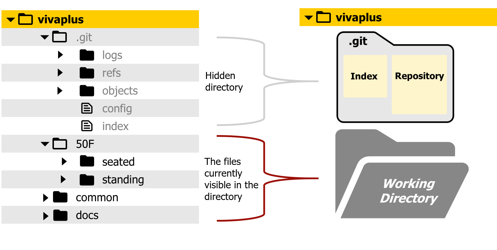
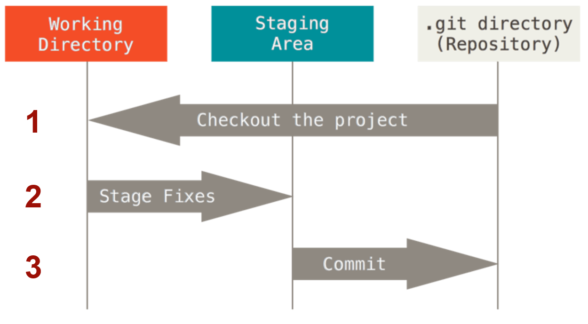
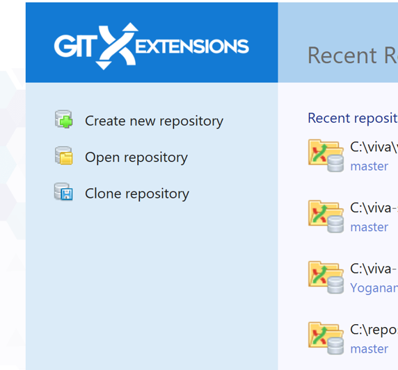
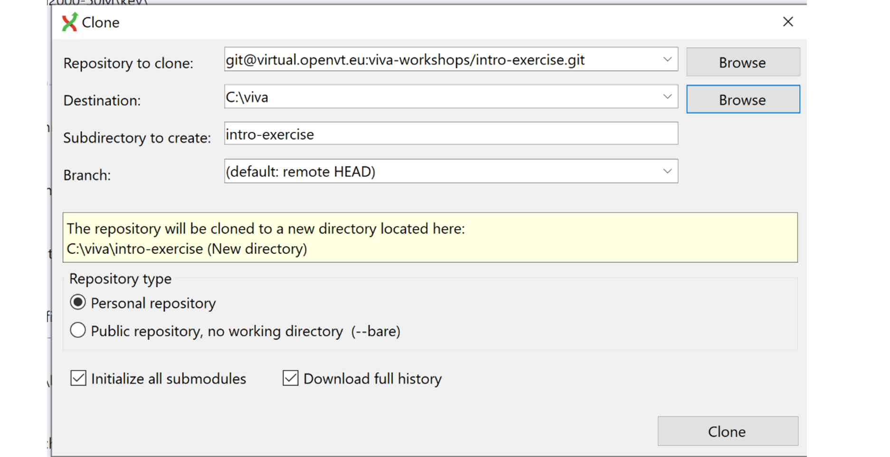
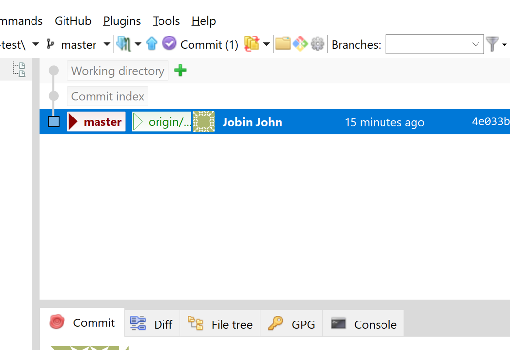

# Basic Git Workflow on Local Repo


## Getting an Intuition

In this section and the next, you will learn how to make commits in your local repo. Before we go into details, it is helpful to get a bigger picture of the workflow by visualizing a git workflow for collaborative development. Try the following steps on http://git-school.github.io/visualizing-git/

This page is embedded below if you prefer to stay on this page

```
git commit -m "Femur Mesh"
git commit -m "TIbia Mesh"

# Make a new branch from "Femur Mesh" commit to add material properties. Give commit id for "Femur Mesh"
git branch  <branch name> <commit id>
git checkout <branch name>
git commit -m "Femur Properties"
git merge master
```

<iframe src="http://git-school.github.io/visualizing-git/" width="100%" height="700"></iframe>

We used command line for the git actions in the example above. We will supplement GUI (GIt Extensions) illustrations in the rest of the workshop for those not familiar with command line. Most of the git actions can be executed through GUI applications

## The Three Git Areas (States)

The files that are tracked by Git can exist in three states: 

- **modified**
- **staged**: marked to go into your next snapshot (to be committed/saved)
- **committed**: data that is saved to your local repository

The files move between three areas depend on their state (Working Directory, Index, [local] Repository)[^1]:

- You modify the files in the **Working Directory** (also known as Working Tree)
- Files that are ready to committed are moved to **Index** (also know as **Staging Area**) to be get them ready for the snapshot
- Files prepared in the Index are then safely stored in your **local Git repository**  



[^1]: 1.3 Getting Started - What is Git?, Pro Git Book, https://git-scm.com/book/en/v2/Getting-Started-What-is-Git%3F

The basic Git workflow [^2] that we are going explore in this section goes something like this (see the figure below):

- You checkout the project and modify files (in your working directory)
- You selectively stage just those changes you want to be part of your next commit, which adds only those changes to the staging area.
- You do a commit, which takes the files as they are in the staging area and stores that snapshot permanently to your Git directory.

[^2]: Adapted from https://git-scm.com/book/en/v2/Getting-Started-What-is-Git%3F



## Hands-on Exercise

### Clone the exercise repo

Go to the directory where you would like to clone your repo and use the clone command. On Windows, you can easily open the Git Bash using right click in your prefered directory

```
git clone git@virtual.openvt.eu:viva-workshops/intro-exercise.git
```

Alternatively on GUI



Use the address for SSH cloning in the Clone window 



This step creates from the remote repo (on OpenVT) and checkout out the latest version to populate your working directory/tree

Enter the repo and check the files in the repo

```
cd intro-exercise
```
You will be able to see a `README.md` and the hidden `.git` folder
### Learn to stage your changes

In this step, we will make changes to the repo and stage the updated files for committing them. You will add a new file and then link this file to the README.

We will be creating a list of the workshop participants

#### Create a new file in the repo

Add a new markdown file `FirstName-LastName.md` to the directory. Open the file and add your name and your work/student affiliation.

#### Check the status of your repo
Check the status of your repo

```
git status
```
You can see that the new file is shown as untracked

On Git Extensions, the green `+` sign indicates that there are new files that are not tracked



### Stage and Commit 

The first step to store your new file or update a modified file is to stage it. `git add` is the command for this action

```
git add FirstName-LastName
```

If you `git status` again, you will find that this file has been staged to be committed

Now you are ready to make the commit(save) to your Git repository (Doing `git status` again will shown that these files are staged(or are currently in the index region))

You need to provide a commit message as you make the commit. The simple way to do this is to give a one line commit message with the `git commit` command

```
git commit -m "Add FirstName's affiliation"
```

If you again do `git status` now, you will see that the working tree is clean and everything has been committed

