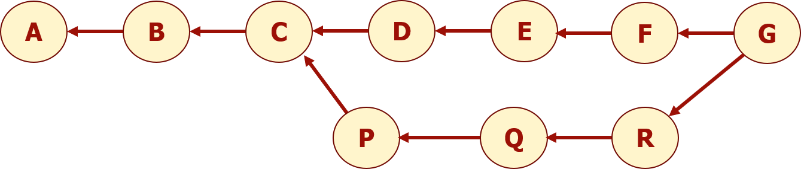

# **Basic Git Workflow**

!!! summary "Overview" 

    **Questions**

    - How can I make updates and save it into the version control?
    - How can I work on my 'copy' of the repo and merge it back?
  
    **Objectives** 
  
    - Learn the basic Git workflow: update-add-commit
    - Implement branches

In this section, you will learn how to work on your local repo

## **The basic workflow**

The basic Git workflow [^2] goes something like this (see the figure below):

1. You checkout the project and modify files (in your working directory)
2. You stage the changes you want to be part of your next commit
3. You make a commit to the repo, which takes the files as they are in the staging area and stores that snapshot permanently to your Git directory.

[^2]: Text and figure adapted from https://git-scm.com/book/en/v2/Getting-Started-What-is-Git%3F

{: style="width:550px"}

### **The Three Git Areas (States)**

The files that are tracked for changes by Git can exist in three states: 

- **modified**: files that you updated or added
- **staged**: files that are ready and that are marked to go into your next snapshot (to be committed/saved)
- **committed**: data that is saved to your local repository


Depending on their state, the files move between **_three areas_** in your local directory[^1]:

- You _modify_ the files in the **Working Directory** (also known as Working Tree). Working directory is the visible section of your repo. 
- Files that are ready to committed are moved to **Index**/**Staging Area**.  This action is commonly refered to as _staging_ (think of it as getting the files _ready for the snapshot_).
- The **local Git repository**  holds the files you _commit_ from Staging Area


[^1]: 1.3 Getting Started - What is Git?, Pro Git Book, https://git-scm.com/book/en/v2/Getting-Started-What-is-Git%3F

## **Git branches**

A repository can have one or more branches. The main branch, where all changes are eventually merged into, is called master. Developers use branches to explore and experiment with updates/features and merge their updates into the master when they are ready. _(In the figure, commits P, Q, and R are on a branch. Commit P on the branch was created from the master. The branch is then merged into the master when ready)_




## **Getting an Intuition**

Try the following git commands one at a time on http://git-school.github.io/visualizing-git/ _(This page is embedded below if you prefer to stay on this page. Trying refreshing if you see a blank embedded window)_

```
git commit -m "Femur Mesh"
git commit -m "TIbia Mesh"

# Make a new branch from "Femur Mesh" commit to add material properties. Give commit id for "Femur Mesh"
git branch  <branch name> <commit id>
git checkout <branch name>
git commit -m "Femur Properties"
git merge master
git checkout master
```

<iframe src="http://git-school.github.io/visualizing-git/" width="100%" height="700"></iframe>

!!! note "Few things to note from the illustration"
    
    - Each commit is identified with a unique commit hash. 
    - A branch is created to work in parallel. The branch is then merged into the ``master`` branch. 
    - the `HEAD` moved as you switched between the branches. `HEAD` indicates the branch where the next commit will be written on. (Think of it like the _'recording head'_ that writes on a gramophone record or CD/DVD)


!!! check "Exercise: Commits and Branches" 
        
        As an exercise, we will be collaboratively creating a list of the workshop participants

        **1. Clone the exercise repo**

        Go to the location where you would like to clone the exercise repo <https://virtual.openvt.eu/viva-workshops/workshop-exercise>. Use the `git clone` command. Use the address for SSH cloning. (On Windows, an easy option is to open the Git Bash using right click in your preferred directory)

            ```
            git clone git@virtual.openvt.eu:viva-workshops/workshop-exercise.git
            ```
        Enter the repo and check the files in the repo

        ```
        cd intro-exercise
        ```
        You will be able to see a `README.md` and the hidden `.git` folder

        **2. Make a branch and switch to the new branch**

        Create a branch `FirstName` for this exercise.

        ```
        git checkout -b FirstName
        ```

        `git checkout -b <branch-name>` is shorthand for:

        ```
        git branch <branch-name>
        git checkout <branch-name>
        ```

        **3. Make changes to the repo**

        In this step, add your name to the README file in your branch and stage the updates to Index(Staging Area) for committing them. 

        Open the README.md file in any text editor and add your name to the Participants section. Save the changes.

        **4. Check the status of your repo**

        Check the status of your repo

        ```
        git status
        ```
        You can see the changes to the repo

        **5. Stage your updates**

        The first step to save your updates is to stage it (to move it to the Index/Staging Area). `git add` is the command for this action

        ```
        git add README.md
        ```

        **6. Commit your changes**

        Now you are ready to make the commit(save) to your Git repository (Doing `git status` again will shown that the staged files are staged(or are currently in the index region))

        You need to provide a commit message as you make the commit. The easy way to do this is to give a one line commit message with the `git commit` command

        ```
        git commit -m "Add <your-name> to README.md"
        ```

        If you again do `git status` now, you will see that the working tree is clean and everything has been committed

#### a. Create a new file in the repo

Add a new markdown file `FirstName-LastName.md` to the directory. Open the file and leave a message.

#### b. Check the status of your repo
Check the status of your repo


#### 

{: style="width:350px"}

If you `git status` again, you will find that this file has been staged to be committed.

_If you are using Git Extensions,_ click on the Commit button on the toolbar at the top to open the Commit Window. Select only the files that you want to commit and select Stage to move them to the Index/Staging Area


#### d. Commit


{: style="width:350px"}


!!! example "Breakout Room Task: Edit the README"
    
    We are collaboratively preparing a list of the participants in the README.md files. In this step, you will add your name to the README file and link the text file you created in the previous step.   

    1. Edit the README.md to add your name to the list of workshop participants.
    2. Link you name on the README to the file you created using the markdown syntax for linking `[Text to link](Link)`:
         ```
         [FirstName LastName](FirstName-LastName.md)
         ```
    3. Check the status using `git status`
    4. Stage and commit the README file with a commit message.
        ```
        git add README.md
        git commit -m "Add FirstName to Participant list"
        ```


## *Summary*

!!! summary "Recap" 
        

        - `git add`:
        - `git commit`:
        - `git branch`: