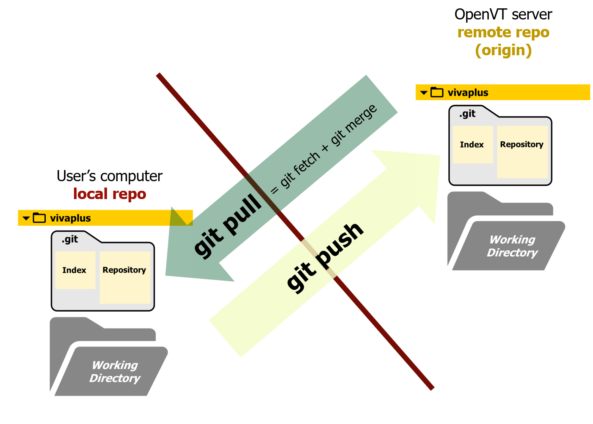

# Working with Remote Repo

!!! summary "Overview" 

    **Questions**
  
    **Objectives** 
  

In this section you will learn to interact with the remote repo

## 1. Create an Issue

Note the issue number for later reference

## 2. Push

Now you are ready to push the changes you made in your branch to the remote repo

```
git push orgin FirstName-LastName
```


## Submit a Merge Request

Using the issue number

## Pull the latest version of the repo

After the merge request has been approved, pull the repo to see your changes updated to the repo

```
git pull
```

```
git pull --rebase
```

### Fetch


### Merge/Rebase


## More Resources

- [Graphical Interactive cheatsheet](https://ndpsoftware.com/git-cheatsheet.html)