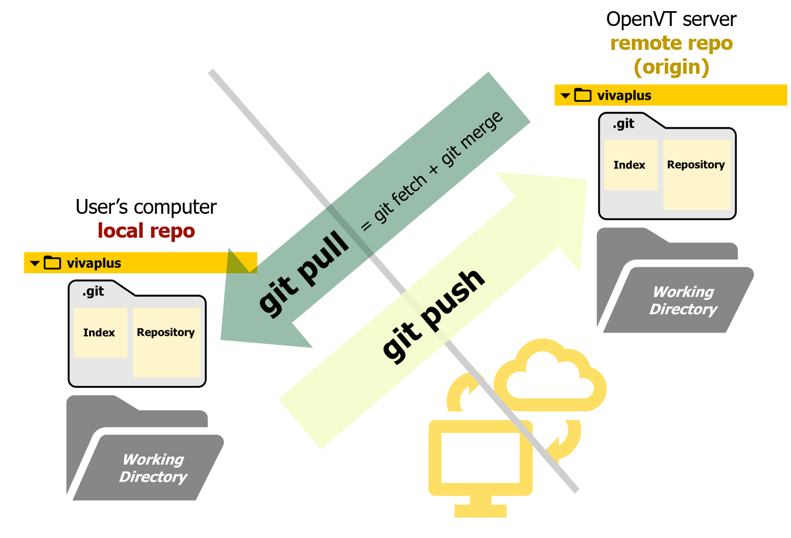

# Working with Remote Repo

!!! summary "Overview" 

    **Questions**

    - How can I report an issue/error or request a feature/update with the model/library?
    - How can I make my changes available on the remote repo?
    - How can I submit a request to merge my updates to the model?
    - How can I get updates from the remote repo on my local repo?
  
    **Objectives** 

    - Get familiar with the Gitlab issue board for issue creation and project planning
    - Learn to push updates to the remote Git server
    - Execute a merge request submission of your branch
    - Learn to pull updates from the remote Git server
  

 This section of the Git workshop focusses on interacting with the remote repo.

## **1. Create an Issue**
_"The GitLab issue tracker is an advanced tool for collaboratively developing ideas, solving problems, and planning work. Issues can allow sharing and discussion of proposals before, and during, their implementation."_[^1]

In this exercise, you will be creating an issue to let the repo maintainers (workshop organizers) know that you would like to add your name to the participants list. To do this, complete these steps:

- On the Gitlab web interface, select `Issues` on the left panel. You can create an issue by selecting `list` or `board`.
    - List gives you a list of all the issues posted on this repo
    - The board categorizes the issues based on their labels
- Assign the issue to yourself as you plan to handle this issue.
- Go to the board and move it to the `Doing` board as you plan to tackle this issue now


Note the issue number of the issue you just create for later reference.This number will be used to submit a merge request.

[^1]: https://docs.gitlab.com/ee/user/project/issues/

## 2. Push

Now you are ready to push the changes you made in your branch to the remote repo

```
git push orgin FirstName-LastName
```



## Submit a Merge Request

Using the issue number

## Pull the latest version of the repo

After the merge request has been approved, pull the repo to see your changes updated to the repo

```
git pull
```

```
git pull --rebase
```

### Fetch


### Merge/Rebase

!!! question "What happens when you switch branches?"

    > This is an important point to remember: when you switch branches, Git resets your working directory to look like it did the last time you committed on that branch. It adds, removes, and modifies files automatically to make sure your working copy is what the branch looked like on your last commit to it.
        


## More Resources

- [Graphical Interactive cheatsheet](https://ndpsoftware.com/git-cheatsheet.html)