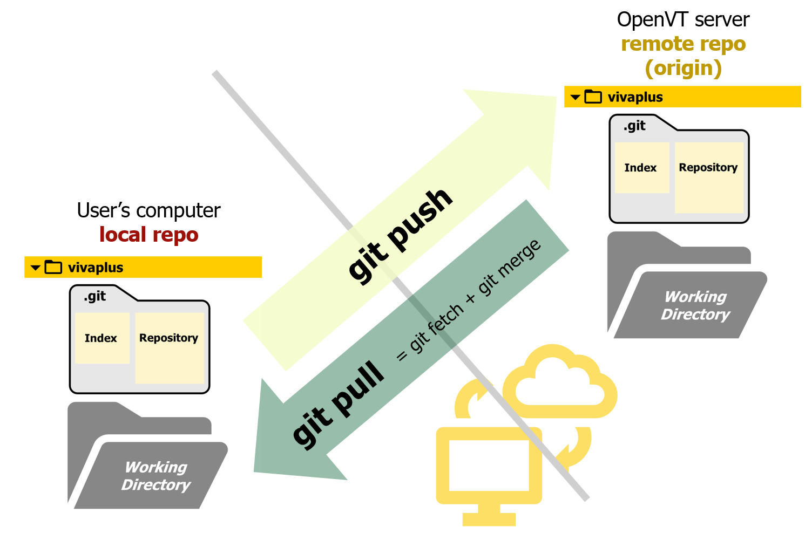

# **Working with Remote Repo**

!!! summary "Overview" 

    **Questions**

    - How can I make my changes available on the remote repo?
    - How can I submit a request to merge my updates to the model?
    - How can I get updates from the remote repo on my local repo?
  
    **Objectives** 

    - Learn to push updates to the remote Git server
    - Execute a merge request submission of your branch
    - Learn to pull updates from the remote Git server
  

 This section focusses on interacting with the remote repo.


## **Push your updates**

Now you are ready to push the changes you made in your branch to the remote repo. The command for this is `git push <remote name> <branch name>`. In our case, the remote repo has the default name `origin`, so use the following command to **push your branch** to the remote repo

```
git push origin <branch>
```

<!--- _If you are using Git Extensions_, use the Push button on the top toolbar to open the Push Window. Select the Remote, in our case `origin`, to push your branch.

 -->

!!! check "Bonus Exercise: Add a new file to the repo and link it to the README"
    
    **1. Create a new Markdown(.md) file and leave a message in it**
    
    Create a new text file and save it as a markdown file. For example: `Name.md`
    Check what `git status` tells you now

    **2. Link this file to your name in the README**

    The markdown syntax to link is `[text to link](link)`. Add a link to your name like this [First-name](Name.md)

    **3. Commit your updates**

    Add your files using `git add` and commit them using `git commit -m "Commit Message"`

    **4. Push your branch again**

        


## **Submit a Merge Request**

This step submits your updates for the approval and merging of the repo maintainters.

- Select the Source branch (your branch to merge) and target branch (master)
- Give a title (and description) to your merge request. 
- Add 'closes #issuenumber' or 'fix #issuenumber' (Example, `closes #21`/`fix #7`) to the title to indicate that this merge request closes your `#issuenumber`.
- Assign the merge request to one of the maintainers of the repo
- Add the group `VIVA Workshops` as the approvers. The maintainers of that group will then get a request to review and approve your merge request
- Submit your merge request (Green button)

??? tip "Tip: Keywords that close an issue"
    
    The following keywords can be used in the merge request to close an issue [^1]

    - Close, Closes, Closed, Closing, close, closes, closed, closing
    - Fix, Fixes, Fixed, Fixing, fix, fixes, fixed, fixing
    - Resolve, Resolves, Resolved, Resolving, resolve, resolves, resolved, resolving
    - Implement, Implements, Implemented, Implementing, implement, implements, implemented, implementing 

    [^1]: https://docs.gitlab.com/ee/user/project/issues/managing_issues.html#default-closing-pattern

## **Pull updates from remote repo**

```
git pull <remote name> <branch name>
```

Here we use the `rebase` option. The rebase option moves commits on your local repo ahead of the changes from the remote repo, if possible, so that you get a clean linear history when you push your updates to the remote repo.

<!-- _If you are using Git Extensions_, get the drop-down menu beside the pull button to select 'Pull-rebase'

{: style="width:350px"} -->

`git pull` is a combination two git actions:

- `git fetch` : fetch the latest update on a branch/repo from the remote
- `git merge`: merges these updates to the current state of your repo

You can do these steps manually if you prefer to have more control over the pull process.

!!! question "What happens when you switch branches?"

    An important point to remember:
    
    -  when you switch branches, Git resets your working directory to look like it did the last time you committed on that branch. 
    -  It adds, removes, and modifies files to make your working directory look like what the branch looked like on your last commit to it.
        
## More Resources

- [Graphical Interactive cheatsheet](https://ndpsoftware.com/git-cheatsheet.html)