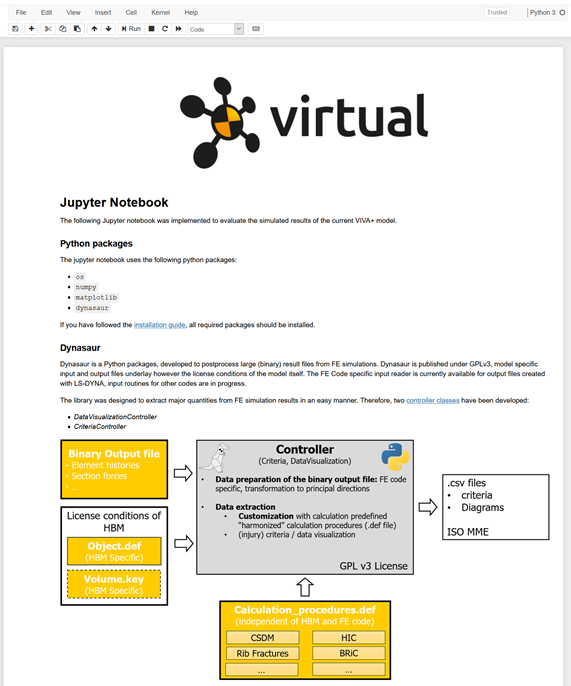
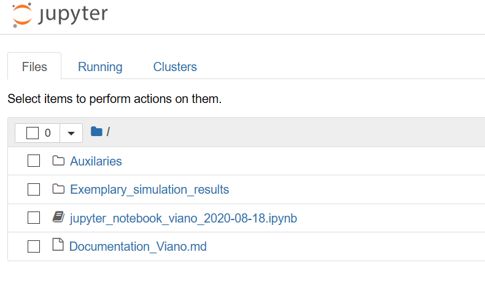
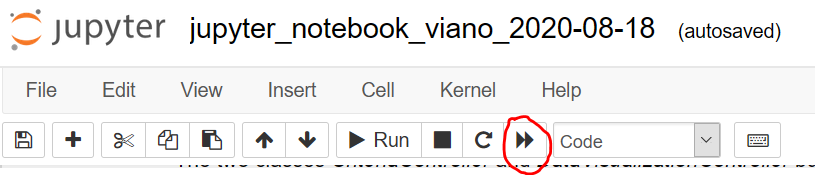

# Postprocessing with Jupyter & Dynasaur

Files with the .ipynb extensions are jupyter notebooks. Clicking on the Viano_V1.ipynb file, should therefore open the notebook in a further tab. As already indicated, jupyter notebooks are interactive documents and allow scripting. The provided notebook contains a short description of the dynasaur python package (written in markdown) and how data from the simulation result files can be extracted by its usage. Therefore, the notebook directly loads and visualizes simulated results of interest. 

## Open a Jupyter notebook
###1.) Open your Anaconda Console (Anaconda Prompt)
###2.) Navigate to your local directory

>``pushd C:\"your path"\intro_exercis\Postprocessing``

###4.) If you have installed dynasaur and jupyter in a specific environment, then activate it at first 

>``activate dynasaur``

###3.) Start jupyter notebook 

> ``jupyter notebook``

###4.) Jupyter should start to run in your webbrowser:

###5.) click on [jupyter-notebook-viano-2020-08-18.ipynb](http://localhost:8888/notebooks/jupyter_notebook_viano_2020-08-18.ipynb) to open the exemplary notebook we have shared with you

###6.) Run the notebook - Click on "Restart and run all cells"

###7.) Have a look at the notebook

Which input files are used?

#### Input files
in cell 3 you find the path definition for your simulation output files and your auxilaries - currently this is relative to your active driectory, but you can also change it to an absoulte path

e.g. 
>``input_dir = r"C:\Users\...\Input``

## Connection with Dynasaur

Dynasaur Input files are written in json. If you change something in a big file, it can help to use a json validator - e.g. https://jsonlint.com/

###Object.def

The object definition file contains information about the simulated models and defines identifiers which are further used within the calculation routines.

For further details, look at the [Dynasaur Wiki](https://gitlab.com/VSI-TUGraz/Dynasaur/-/wikis/Object-Definition-File)

#### Calculation_procedure.def

As the name say, all calculation procedures, defines what we want to do with the outputs

Several standard functions are implemented, so that we can easily define which object should be used for specific criteria (e.g. HIC calculation, quality criteria), or channels (Data Visualisation - e.g. which CFC filter should be applied on the acceleration signals)

For further details, look at the [Dynasaur Wiki](https://gitlab.com/VSI-TUGraz/Dynasaur/-/wikis/Calculation-Procedure-Definition-File)

### Task 1: Visualise the result files from \Viano_Pelvis_HS_Adjusted_Flesh_Material

###Task2: Create a plot which shows the added mass as a function of time

###Task3 (Advanced): Visualise the impactor velocity as a function of time

