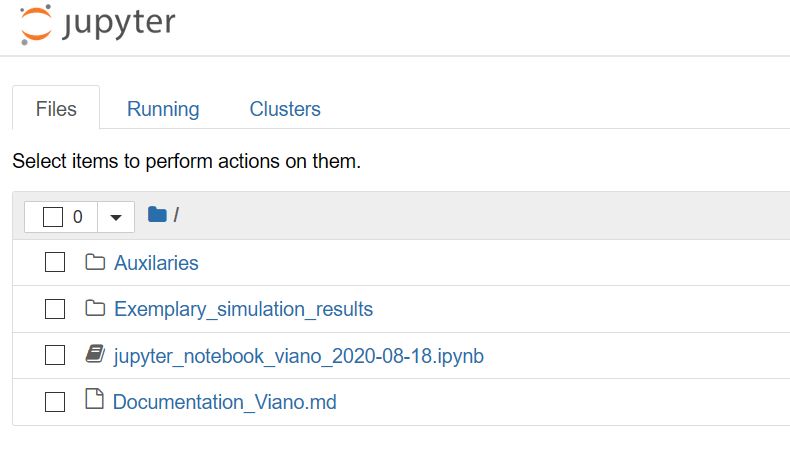
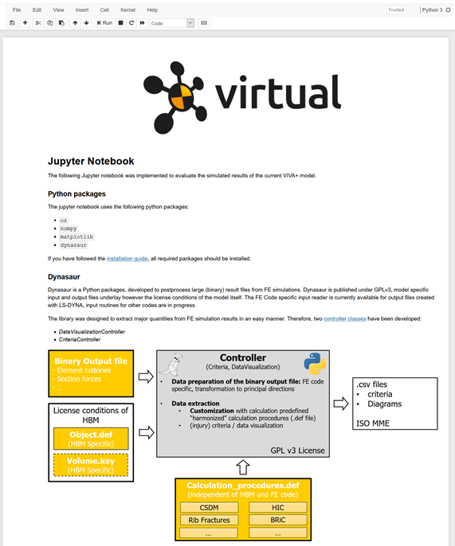
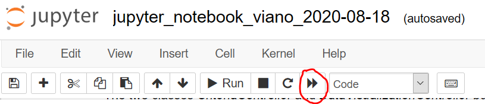

# **Postprocessing with Jupyter Notebook & Dynasaur**

Files with the .ipynb extensions are Jupyter Notebooks. Clicking on the Viano_V1.ipynb file, should therefore open the notebook in a further tab. As already indicated, jupyter notebooks are interactive documents and allow scripting. The provided notebook contains a short description of the dynasaur python package (written in markdown) and how data from the simulation result files can be extracted by its usage. Therefore, the notebook directly loads and visualizes simulated results of interest.

## **Open a Jupyter notebook**

1. Open your Anaconda Console (Anaconda Prompt)

2. Navigate to your local directory
```
pushd C:\"your path"\intro_exercis\Postprocessing
```

3. If you have installed dynasaur and Jupyter Notebook in a specific environment, then activate it at first 
```
activate viva_workshop
```
4. Start Jupyter Notebook 
```
jupyter notebook
```
5. Jupyter Notebook should start to run in your webbrowser:


6. Click on [Jupyter Notebook](http://localhost:8888/notebooks/Jupyter_Notebook_Viano_internal_workshop.ipynb) to open the exemplary notebook we have shared with you


7. Run the notebook - Click on "Restart and run all cells"


8. Have a look at the notebook

Which input files are used?

#### Input files
in cell 3 you find the path definition for your simulation output files and your auxilaries - currently this is relative to your active driectory, but you can also change it to an absoulte path

e.g. 
>``input_dir = r"C:\Users\...\Input``


## **Connection with [Dynasaur](3-2-postprocess-dynasuar.md)**


## Tasks

### Task 1: Visualise the result files from another simulation

Try to visualise the simulation results of an alternative material model. You can find those results in your directory under \Viano_Pelvis_HS_Adjusted_Flesh_Material

Post your observations on [Mentimeter](https://www.menti.com/rj7ki1t5x7)

<div style='position: relative; padding-bottom: 56.25%; padding-top: 35px; height: 0; overflow: hidden;'><iframe sandbox='allow-scripts allow-same-origin allow-presentation' allowfullscreen='true' allowtransparency='true' frameborder='0' height='315' src='https://www.mentimeter.com/embed/8de0ef5ac6fe10c65bf7c2d9bed6a687/f96965b5ffb0' style='position: absolute; top: 0; left: 0; width: 100%; height: 100%;' width='420'></iframe></div>


### Task 2 (Advanced): Create a plot which shows the added mass as a function of time

Add another graph after the energy graphs, which shows the added mass as a function of time

Find the correct naming of the channel in the Dynasaur file
[Dynasaur](3-2-postprocess-dynasuar.md)


### Task 3 (Advanced): Visualise the impactor velocity as a function of time

- Add the channel in Calculation_procedure.def ([Dynasaur](3-2-postprocess-dynasuar.md))
- Add the plot in the jupyter notebook


## Summary

Switch to [Mentimeter](https://www.menti.com/1jgi9w7kok)


