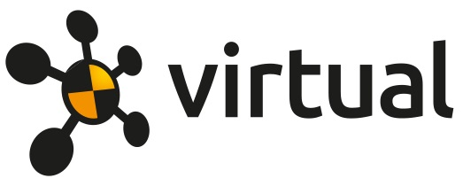

<h1>**VIVA+ Workshop**</h1>

## **What will I learn?**

- Get introduced to **VIVA+ models** and **OpenVT** platform
- Learn to collaborate and contribute to **Open Source** using Git
- Learn to **postprocess** VIVA+ simulations using Python-based Dynasaur library

## **Who is it intended for?**

Anyone interested in Biomechanics and contributing to Open Source

- Students 
- Researchers
- Engineers

## **What should I do before the workshop?**

1. Sign up on [OpenVT](https://virtual.openvt.eu/)
2. [Install and configure Git](0-setup) on your computer
3. Install the packages required for the workshop

  <a rel="license" href="http://creativecommons.org/licenses/by/4.0/">Creative Commons Attribution 4.0 International License</a>.